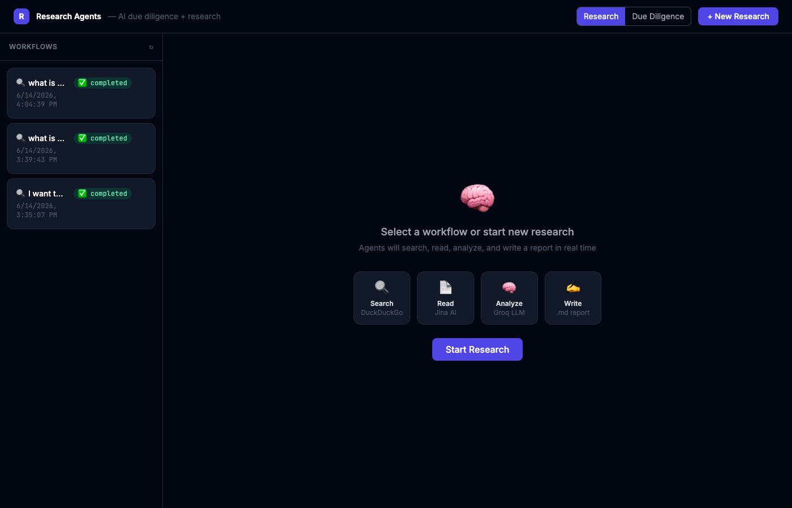

# Research Agents

A multi-agent research system built from scratch — no LangChain, no CrewAI. You give it a question, it searches the web, reads the pages, synthesizes the findings, and writes a markdown report. A React dashboard streams every agent action live via WebSocket as it happens.

**~725 lines of Python and React. Fully functional. 100% free APIs.**

  



---

## What it does

1. You type a research question into the dashboard
2. The **OrchestratorAgent** uses an LLM to plan 3–5 targeted search queries
3. The **SearchAgent** runs them through DuckDuckGo (no API key needed)
4. The **ReaderAgent** fetches and extracts content from the top URLs via Jina AI
5. The **AnalyzerAgent** synthesizes everything into a structured analysis
6. The **WriterAgent** turns that analysis into a polished markdown report, saved to `research_outputs/`

Every step is visible in real time on the dashboard — you watch agents think, search, read, and write as it happens.

---

## Agent pipeline

```
Query → OrchestratorAgent (plans queries)
          ├── SearchAgent     → DuckDuckGo results
          ├── ReaderAgent     → page content via Jina AI
          ├── AnalyzerAgent   → LLM synthesis
          └── WriterAgent     → markdown report saved to disk
```

| Agent | Role | Model/Tool |
|---|---|---|
| OrchestratorAgent | Plans queries, coordinates pipeline | Groq llama-3.3-70b-versatile |
| SearchAgent | Web search | DuckDuckGo (free, no key) |
| ReaderAgent | Page content extraction | Jina AI Reader (free tier) |
| AnalyzerAgent | Research synthesis | Groq llama-3.3-70b-versatile |
| WriterAgent | Report writing + file save | Groq llama-3.3-70b-versatile |

---

## Stack

| Layer | Tech |
|---|---|
| Backend | FastAPI + Python 3.11+ |
| LLM | Groq API (free tier — 30 req/min) |
| Search | duckduckgo_search (no API key) |
| Reader | Jina AI `r.jina.ai` (free tier) |
| Database | SQLite + aiosqlite |
| Real-time | WebSocket (native FastAPI) |
| Frontend | React 18 + Vite + Tailwind CSS |

---

## Setup

### 1. Clone

```bash
git clone https://github.com/gkaransail/research-agents.git
cd research-agents
```

### 2. Backend

```bash
cd backend
pip install -r requirements.txt
```

Create `.env` in the `backend/` directory:

```
GROQ_API_KEY=gsk_...          # Required — get free at console.groq.com
PRIMARY_MODEL=llama-3.3-70b-versatile
FAST_MODEL=llama-3.1-8b-instant
MAX_SEARCH_RESULTS=8
MAX_READ_URLS=5
```

Start the server:

```bash
uvicorn main:app --host 0.0.0.0 --port 8001 --reload
```

### 3. Frontend

```bash
cd frontend
npm install
npm run dev
```

Open **http://localhost:5174**

---

## Usage

1. Open the dashboard at http://localhost:5174
2. Click **New Research** and enter any question
3. Watch the agent timeline update live as each agent works
4. When complete, click **View Report** to read the markdown output
5. Reports are also saved to `research_outputs/` as `.md` files

---

## Project structure

```
research_agents/
├── backend/
│   ├── main.py                 # FastAPI app + WebSocket server
│   ├── agents/
│   │   ├── base.py             # BaseAgent — subclass this to add agents
│   │   ├── registry.py         # @register_agent decorator + auto-discovery
│   │   ├── orchestrator.py     # Pipeline coordinator
│   │   ├── searcher.py         # DuckDuckGo search
│   │   ├── reader.py           # Jina AI content extraction
│   │   ├── analyzer.py         # LLM synthesis
│   │   └── writer.py           # LLM report writing
│   ├── core/
│   │   ├── config.py           # Pydantic settings
│   │   ├── database.py         # SQLite schema + CRUD
│   │   ├── llm.py              # Groq client with retry + backoff
│   │   └── workflow.py         # WorkflowManager + WebSocket broadcaster
│   └── models/
│       └── schemas.py          # Pydantic request/response schemas
├── frontend/
│   └── src/
│       ├── App.jsx
│       ├── components/
│       │   ├── NewResearch.jsx
│       │   ├── WorkflowList.jsx
│       │   ├── WorkflowDetail.jsx
│       │   ├── AgentTimeline.jsx  # Live event stream
│       │   └── OutputViewer.jsx   # Markdown viewer
│       └── hooks/
│           └── useWorkflow.js     # WebSocket hook
├── research_outputs/           # Generated .md reports
├── logs/
└── docker-compose.yml
```

---

## Adding a new agent

1. Create `backend/agents/my_agent.py`:

```python
from agents.base import BaseAgent
from agents.registry import register_agent

@register_agent("my_agent")
class MyAgent(BaseAgent):
    async def run(self, task: dict) -> dict:
        await self.emit("thinking", "Starting...")
        # do work
        await self.emit("completed", "Done!", data={"result": "..."})
        return {"result": "..."}
```

2. Add one import in `main.py`:

```python
import agents.my_agent  # noqa
```

3. Wire it into `agents/orchestrator.py` where it fits in the pipeline.

That's it — the registry discovers it automatically.

---

## How it compares to frameworks

| Feature | This project | LangChain | CrewAI |
|---|---|---|---|
| Lines of code | ~725 | ~80,000 | ~5,000 |
| Agent contract | `BaseAgent.run()` | `AgentExecutor` | `Agent` class |
| Orchestration | `OrchestratorAgent` | `SequentialChain` | `Crew` |
| Memory | SQLite `workflow_events` | `ConversationBufferMemory` | Built-in |
| Real-time UI | WebSocket dashboard | None | None |
| Code you own | 100% | ~10% | ~20% |

---

## Ports

- Backend API: `8001`
- Frontend: `5174`

---

## License

MIT
